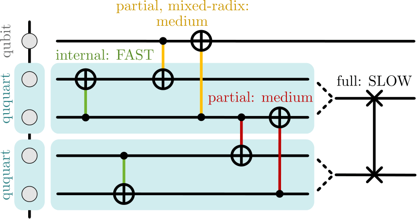

---

[CV](/files/JasonChadwickCV.pdf) \| <a href="https://github.com/jasonchadwick" target="_blank" rel="noopener noreferrer">Github</a> \| <a href="https://linkedin.com/in/jasonchadwick" target="_blank" rel="noopener noreferrer">Linkedin</a> \| <a href="https://scholar.google.com/citations?user=kE5iFs0AAAAJ&hl=en" target="_blank" rel="noopener noreferrer">Scholar</a> \| <a href="https://orcid.org/0000-0002-7932-1418" target="_blank" rel="noopener noreferrer">ORCiD</a>

[jchadwick@uchicago.edu](mailto:jchadwick@uchicago.edu)

    <figure style="width: 30%">
    
    </figure>

    

    I am a first-year computer science Ph.D. student at the University of Chicago studying quantum computer systems with <a href="https://people.cs.uchicago.edu/~ftchong/" target="_blank" rel="noopener noreferrer">Fred Chong</a>. Previously, I graduated from Carnegie Mellon University with a B.S. in physics and a minor in computer science. 
    

    

    My research focuses on low-level software optimizations that narrow the gap between existing error-prone hardware and long-term goals of large scale fault-tolerant quantum computation. I have worked on projects related to quantum optimal control, high-radix computation, and circuit compilation. I've recently become interested in error mitigation and closed-loop control. My work is part of <a href="https://www.epiqc.cs.uchicago.edu/" target="_blank" rel="noopener noreferrer">EPiQC</a>, an NSF Expedition in Computing.
    

## Selected Publications

*\* indicates equal contribution. See [CV](/files/JasonChadwickCV.pdf) for a full list of publications.*

<figure style="width: 50%">
    
    </figure>

    *(to appear)* **Qompress: Efficient Compilation for Ququarts Exploiting Partial and Mixed Radix Operations for Communication Reduction**
     A. Litteken, L.M. Seifert, **J. Chadwick**, N. Nottingham, J.M. Baker, F.T. Chong. 
     *ASPLOS 2023*

- **Time-Efficient Qudit Gates through Incremental Pulse Re-seeding**
 L.M. Seifert\*, **J. Chadwick**\*, A. Litteken, F.T. Chong, and J.M. Baker. 
 *QCE 2022*
 DOI: <a href="https://doi.org/10.1109/QCE53715.2022.00051" target="_blank" rel="noopener noreferrer">10.1109/QCE53715.2022.00051</a>

- **Prediction of electron density and pressure profile shapes on NSTX-U using neural networks**
 M.D. Boyer, **J. Chadwick**. 
 *Nuclear Fusion 61 046024* (2021)
 DOI: <a href="https://doi.org/10.1088/1741-4326/abe08b" target="_blank" rel="noopener noreferrer">10.1088/1741-4326/abe08b</a>

## Posters

- **Synthesizing Efficient Pulses for Practical Qudit Circuits**
 J. Baker, **J. Chadwick**, L.M. Seifert, A. Litteken, N. Nottingham, A. Petersson, S. Guenther and F.T. Chong. 
 *QIP Poster 2022 #650*.
 PDF [poster](/files/QIP-2022.pdf)

- **Machine learning modeling and analysis of density and pressure profiles on NSTX and NSTX-U**
 **J. Chadwick**, M.D. Boyer. 
 *APS DPP Poster 2020, JP13-022*.
 PDF [poster](/files/fusion-poster.pdf), PDF [slides](/files/fusion-slides.pdf), conference <a href="https://meetings.aps.org/Meeting/DPP20/Session/JP13.22" target="_blank" rel="noopener noreferrer">link</a>

## Projects

*Click a project name to read more. See my <a href="https://github.com/jasonchadwick" target="_blank" rel="noopener noreferrer">Github</a> for all public projects.*

- [**neural network for fusion plasma prediction**](/pages/fusion.md) (summer 2020 research): created a neural network with TensorFlow that can reliably predict fusion plasma density and pressure using only real-time-accessible measurements, for use in control systems.

- [**cosmic string research**](/pages/cosmic-strings.md) (summer 2019 research): simulated the time evolution and gravitational wave emissions of cosmic strings.

- [**chronodrifter**](/pages/chronodrifter.md): a 2D puzzle game where the player can change the direction of time. A live WebGL version of the game is hosted at <a href="https://placeholder-studios-dev.github.io/chronodrifter" target="_blank" rel="noopener noreferrer">placeholder-studios-dev.github.io/chronodrifter</a>.

- [**quops**](/pages/quops.md): a checkers-like board game inspired by quantum computing, where moves consist of applying quantum logic gates to adjacent tiles.

