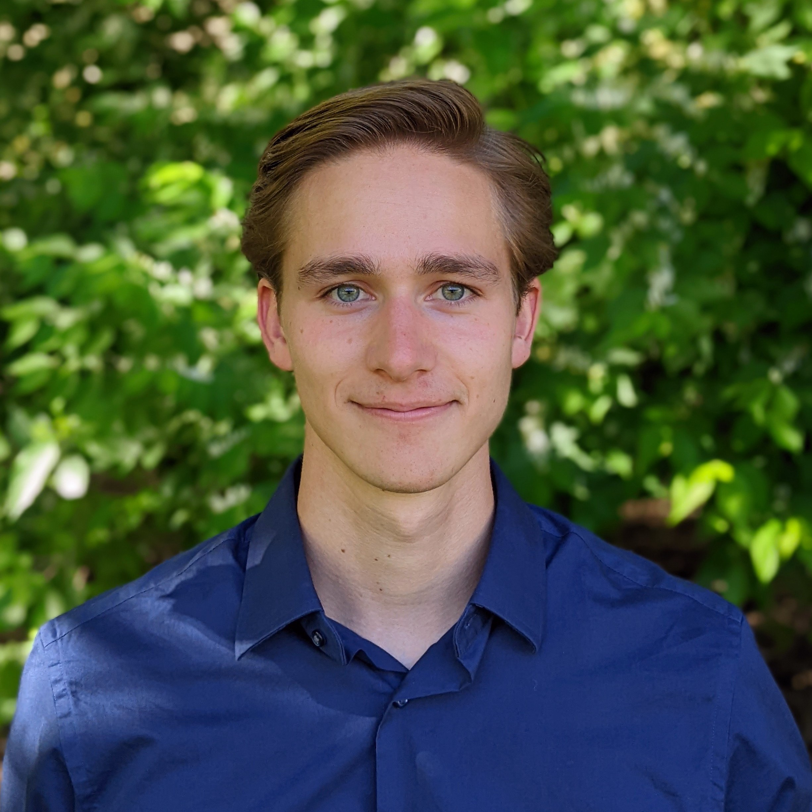

jchadwick (at) uchicago.edu **|** [resume](/files/resume.pdf) **|** [Github](https://github.com/jasonchadwick/) **|** [LinkedIn](https://linkedin.com/in/jasonchadwick) **|** [Scholar](https://scholar.google.com/citations?user=kE5iFs0AAAAJ&hl=en) **|** [ORCiD](https://orcid.org/0000-0002-7932-1418)

---

I am currently pursuing a computer science Ph.D. at the University of Chicago, studying quantum computer architecture. I graduated from Carnegie Mellon University in 2022 with a B.S. in physics and a minor in computer science. My interests within quantum computing include multi-valued logic, optimal control and compilation. My other interests include video game design, biking, and playing guitar.

 

### Projects

---

*Click a project name to read more. See my [Github](https://github.com/jasonchadwick/) for all public projects.*

#### Academic

[**quantum optimal control**](/pages/pulses.md) (summer 2021 - present): Found optimal control pulses for transmon quantum computers, focusing on qudit operations. These pulses determine how much time it takes to apply certain quantum logic gates. I found pulses that allow for high-radix gate times significantly faster than theoretically expected, opening the door to new qudit-based optimizations to quantum circuits.

[**neural network for fusion plasma prediction**](/pages/fusion.md) (summer 2020 research): created a neural network using TensorFlow that can reliably predict fusion plasma density and pressure using only real-time-accessible measurements, for use in control systems. This approach is orders of magnitude faster than existing physics-based simulation code while maintaining high accuracy.

[**cosmic string research**](/pages/cosmic-strings.md) (summer 2019 research): simulated the time evolution and gravitational wave emissions of cosmic strings. Cosmic strings are proposed creases in spacetime that are leftovers from the expansion of the universe.

#### Personal projects

[**chronodrifter**](/pages/chronodrifter.md): a 2D puzzle game where the player can change the direction of time. I am hoping to publish it as a standalone game sometime in the future and potentially make a 3D version afterwards. A live WebGL version of the game is hosted at <a href="https://placeholder-studios-dev.github.io/chronodrifter" target="_blank" rel="noopener noreferrer">placeholder-studios-dev.github.io/chronodrifter</a>.

[**quops**](/pages/quops.md): a checkers-like board game inspired by quantum computing, where moves consist of applying quantum logic gates to adjacent tiles. Currently not released anywhere, but I am thinking about it in the future after polishing it more.

### Publications

---
*\* indicates equal contribution*

- *(under review)* Time-Efficient Qudit Gates through Incremental Pulse Re-seeding. L.M. Seifert\*, **J. Chadwick**\*, A. Litteken, F.T. Chong, and J.M. Baker. *QCE 2022*
 (see [quantum optimal control](/pages/pulses.md) for more info)

- [Synthesizing Efficient Pulses for Practical Qudit Circuits.](/files/QIP-2022.pdf) J. Baker, **J. Chadwick**, L.M. Seifert, A. Litteken, N. Nottingham, A. Petersson, S. Guenther and F.T. Chong. *QIP Poster 2022 #650.*
 (see [quantum optimal control](/pages/pulses.md) for more info)

- <a href="https://doi.org/10.1088/1741-4326/abe08b" target="_blank" rel="noopener noreferrer">Prediction of electron density and pressure profile shapes on NSTX-U using neural networks.</a> M.D. Boyer, **J. Chadwick**. *Nuclear Fusion 61 046024.* (2021) 
 (see [fusion neural network](/pages/fusion.md) for more info)

- <a href="https://meetings.aps.org/Meeting/DPP20/Session/JP13.22" target="_blank" rel="noopener noreferrer">Machine learning modeling and analysis of density and pressure profiles on NSTX and NSTX-U.</a> **J. Chadwick**, M.D. Boyer. *APS DPP Poster 2020, JP13-022*
 (see [fusion neural network](/pages/fusion.md) for more info)

### Programming Languages

---

I have worked on personal and academic projects in:

- **Julia:** [quantum optimal control](/pages/pulses.md).
- **Python:** [fusion neural network](/pages/fusion.md), [quops game](/pages/quops.md).
- **C#/Unity:** [chronodrifter game](/pages/chronodrifter.md), quops - graphical edition *(coming soon)*.
- **Common Lisp:** [cosmic strings](/pages/cosmic-strings.md).
- **C++:** projects for Discrete Differential Geometry course, implementing foundational computer graphics algorithms on simplicial complexes.
- **C:** projects for Computer Systems course, including an implementation of malloc, a unix shell, and a web proxy.

I have experience in various others such as Java/JavaScript, SML, Bash, and Mathematica.
