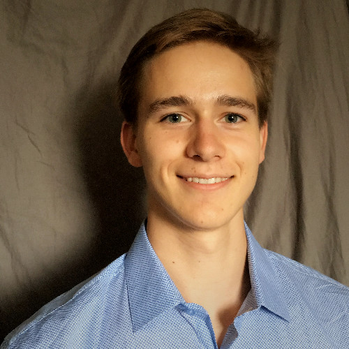

jasoncha (at) andrew.cmu.edu ┃ [resume](/files/resume.pdf) ┃ [Github](https://github.com/jasonchadwick/) ┃ [LinkedIn](https://linkedin.com/in/jasonchadwick) ┃ [Google Scholar](https://scholar.google.com/citations?user=kE5iFs0AAAAJ&hl=en) ┃ [ORCiD](https://orcid.org/0000-0002-7932-1418)

---

I am graduating from Carnegie Mellon University in May with a degree in physics and a computer science minor. Next year, I will be pursuing a computer science Ph.D. at the University of Chicago, studying quantum computer architecture. My interests include applied physics, fusion energy, quantum computing, video game design, reading, taking care of my plants, and playing guitar.

 

### Projects

---

*Click a project name to read more*

[**chronodrifter**](/pages/chronodrifter.md): a 2D puzzle game where the player can change the direction of time. I am hoping to publish it as a standalone game sometime in the future and potentially make a 3D version afterwards. A live WebGL version of the game is hosted at <a href="https://placeholder-studios-dev.github.io/chronodrifter" target="_blank" rel="noopener noreferrer">placeholder-studios-dev.github.io/chronodrifter</a>.

[**quops**](/pages/quops.md): a checkers-like board game inspired by quantum computing, where moves consist of applying quantum logic gates to adjacent tiles. Currently not released anywhere, but I plan to in the future after polishing it more.

[**quantum optimal control**](/pages/pulses.md) (summer 2021 - present): Found optimal control pulses for transmon quantum computers, focusing on qudit operations. These pulses determine how much time it takes to apply certain quantum logic gates. I found pulses that allow for high-radix gate times significantly faster than theoretically expected, opening the door to new qudit-based optimizations to quantum circuits.

[**neural network for fusion plasma prediction**](/pages/fusion.md) (summer 2020 research): created a neural network using TensorFlow that can reliably predict fusion plasma density and pressure using only real-time-accessible measurements, for use in control systems. This approach is orders of magnitude faster than existing physics-based simulation code while maintaining high accuracy.

[**cosmic string research**](/pages/cosmic-strings.md) (summer 2019 research): simulated the time evolution and gravitational wave emissions of cosmic strings. Cosmic strings are proposed creases in spacetime that are leftovers from the expansion of the universe.

### Publications

---

(_accepted submission_) J. Baker, **J. Chadwick** et al. *Synthesizing Efficient Pulses for Practical Qudit Circuits*. QIP 2022 #650.

M.D. Boyer, **J. Chadwick** 2021. *Prediction of electron density and pressure profile shapes on NSTX-U using neural networks*. Nuclear Fusion 61 046024. <a href="https://doi.org/10.1088/1741-4326/abe08b" target="_blank" rel="noopener noreferrer">doi.org/10.1088/1741-4326/abe08b</a>.

**J. Chadwick**, M.D. Boyer 2020. *Machine learning modeling and analysis of temperature and density profiles on NSTX and NSTX-U*. APS Division of Plasma Physics Meeting Abstracts 2020, JP13 022.

### Programming Languages

---

I have worked on personal and academic projects in:

- **Julia**: [optimal pulse control](/pages/pulses.md).
- **Python**: [fusion neural network](/pages/fusion.md), [quops game](/pages/quops.md).
- **Unity/C#**: [chronodrifter game](/pages/chronodrifter.md), quops - graphical edition *(coming soon)*.
- **Common Lisp**: [cosmic strings](/pages/cosmic-strings.md).
- **C++**: projects for Discrete Differential Geometry course, implementing foundational computer graphics algorithms.
- **C**: various projects for Computer Systems course, including an implementation of malloc, a unix shell, and a web proxy.

And various others such as SML, Bash, and Mathematica.
