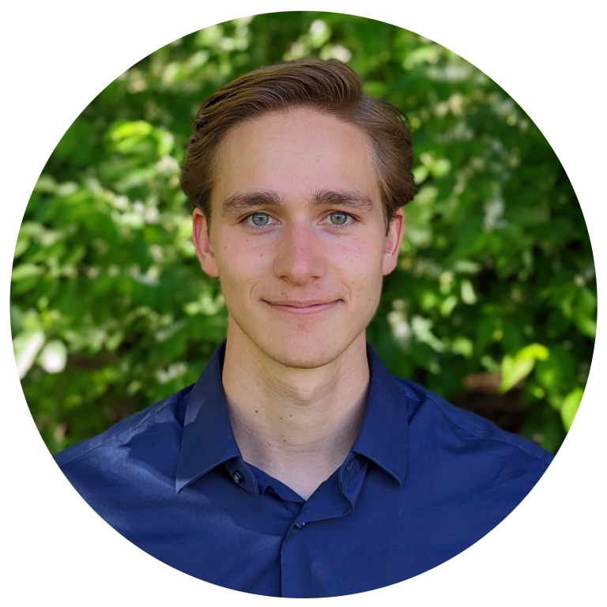

---

[CV](/files/CV.pdf) \| <a href="https://github.com/jasonchadwick" target="_blank" rel="noopener noreferrer">Github</a> \| <a href="https://linkedin.com/in/jasonchadwick" target="_blank" rel="noopener noreferrer">Linkedin</a> \| <a href="https://scholar.google.com/citations?user=kE5iFs0AAAAJ&hl=en" target="_blank" rel="noopener noreferrer">Scholar</a> \| <a href="https://orcid.org/0000-0002-7932-1418" target="_blank" rel="noopener noreferrer">ORCiD</a>

jchadwick@uchicago.edu

I am a first-year computer science Ph.D. student at the University of Chicago studying quantum computer architecture with advisor <a href="https://people.cs.uchicago.edu/~ftchong/" target="_blank" rel="noopener noreferrer">Fred Chong</a>. I graduated from Carnegie Mellon University in May 2022 with a B.S. in physics and a minor in computer science. 

My research focuses on boosting the capabilities of near-term quantum hardware through hardware-software co-design. I have worked on projects related to quantum optimal control, multi-valued logic, and quantum circuit compilation. I've recently become interested in error mitigation and control theory. My work is part of <a href="https://www.epiqc.cs.uchicago.edu/" target="_blank" rel="noopener noreferrer">EPiQC</a>, an NSF Expedition in Computing.

**Jump to:
[Projects](#projects) | [Publications](#publications) | [Programming Languages](#programming-languages)**

## Projects

*Click a project name to read more. See my <a href="https://github.com/jasonchadwick" target="_blank" rel="noopener noreferrer">Github</a> for all public projects.*

#### Academic

- [**qudit optimal control**](/pages/qudit-pulses.md) (summer 2021 - present): Found control pulses that allow for significantly faster-than-expected high-radix quantum logic gates, opening the door to new qudit-based circuit optimizations.

- [**neural network for fusion plasma prediction**](/pages/fusion.md) (summer 2020 research): created a neural network with TensorFlow that can reliably predict fusion plasma density and pressure using only real-time-accessible measurements, for use in control systems.

- [**cosmic string research**](/pages/cosmic-strings.md) (summer 2019 research): simulated the time evolution and gravitational wave emissions of cosmic strings.

#### Personal

- [**chronodrifter**](/pages/chronodrifter.md): a 2D puzzle game where the player can change the direction of time. A live WebGL version of the game is hosted at <a href="https://placeholder-studios-dev.github.io/chronodrifter" target="_blank" rel="noopener noreferrer">placeholder-studios-dev.github.io/chronodrifter</a>.

- [**quops**](/pages/quops.md): a checkers-like board game inspired by quantum computing, where moves consist of applying quantum logic gates to adjacent tiles.

## Publications

*\* indicates equal contribution*

- *(to appear)* **Qompress: Efficient Compilation for Ququarts Exploiting Partial and Mixed Radix Operations for Communication Reduction**
 A. Litteken, L.M. Seifert, **J. Chadwick**, N. Nottingham, J.M. Baker, F.T. Chong. *ASPLOS 2023*.
 (project: [quantum optimal control](/pages/qudit-pulses.md))

- <a href="https://arxiv.org/abs/2206.14975" target="_blank" rel="noopener noreferrer">**Time-Efficient Qudit Gates through Incremental Pulse Re-seeding**</a>
 L.M. Seifert\*, **J. Chadwick**\*, A. Litteken, F.T. Chong, and J.M. Baker. *QCE 2022*.
 (project: [quantum optimal control](/pages/qudit-pulses.md))

- [**Synthesizing Efficient Pulses for Practical Qudit Circuits**](/files/QIP-2022.pdf) 
 J. Baker, **J. Chadwick**, L.M. Seifert, A. Litteken, N. Nottingham, A. Petersson, S. Guenther and F.T. Chong. *QIP Poster 2022 #650*.
 (project: [quantum optimal control](/pages/qudit-pulses.md))

- <a href="https://doi.org/10.1088/1741-4326/abe08b" target="_blank" rel="noopener noreferrer">**Prediction of electron density and pressure profile shapes on NSTX-U using neural networks**</a> 
 M.D. Boyer, **J. Chadwick**. *Nuclear Fusion 61 046024* (2021).
 (project: [fusion neural network](/pages/fusion.md))

- <a href="https://meetings.aps.org/Meeting/DPP20/Session/JP13.22" target="_blank" rel="noopener noreferrer">**Machine learning modeling and analysis of density and pressure profiles on NSTX and NSTX-U**</a> 
 **J. Chadwick**, M.D. Boyer. *APS DPP Poster 2020, JP13-022*.
 (project: [fusion neural network](/pages/fusion.md))

## Programming Languages

I have worked on personal and academic projects in:

- **Julia:** [quantum optimal control](/pages/qudit-pulses.md).
- **Python:** [fusion neural network](/pages/fusion.md), [quops game](/pages/quops.md).
- **C#/Unity:** [chronodrifter game](/pages/chronodrifter.md), quops - graphical edition *(coming soon)*.
- **Common Lisp:** [cosmic strings](/pages/cosmic-strings.md).
- **C++:** projects for Discrete Differential Geometry course, implementing foundational computer graphics algorithms on simplicial complexes.
- **C:** projects for Computer Systems course, including an implementation of malloc, a unix shell, and a web proxy.

I have experience in various others such as Java/JavaScript, SML, Bash, and Mathematica.

