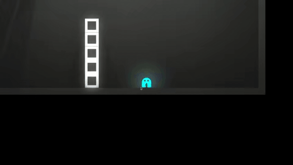

[← back to home](../index.md)

# Chronodrifter: a 2D time-manipulation puzzle platformer

<a href="https://github.com/placeholder-studios-dev/chronodrifter" target="_blank" rel="noopener noreferrer">Github repository</a>

<a href="https://placeholder-studios-dev.github.io/chronodrifter" target="_blank" rel="noopener noreferrer">Live web game</a>

---

<figure style="float: right; width: 300px; margin: 15px">

<figcaption style="text-align: center">Climbing a tower of blocks by first knocking it over and then reversing time.</figcaption>
</figure>

Chronodrifter is a 2D puzzle platformer based around the idea of time reversal. The player can slow down and reverse the time of their environment without affecting their own timeline, which allows for cool tricks like below:

I began the project in the summer of 2021 and resumed working on it that winter after the semester ended, along with a few friends (we are now ). We plan to release the game once we develop it further, and potentially create a 3D version in the future.

### Storing time history of objects

---

Each time-reversible object maintains a stack of previous states. A new state is pushed to this stack at every forward time interval. When time is reversed, states are popped off the stack and applied to the object. For example, the blocks in the gif above have a state consisting of their position, velocity, rotation, and angular velocity. When time is moving in reverse, the block will pop a state off the history stack, set its position to the position value of the previous state, and set its velocity to the negative of the previous state velocity.

For performance reasons, this stack is actually implemented as a fixed-size array with enough space to hold an hour of states.

### Slowing down time

---

Unity will not allow the fundamental time step to change, so to slow down time by (e.g.) 10x, we must decrease all velocities and forces by 10x, and only save every 10th state to the state history stack.

When time is simultaneously slowed down **and** reversed, there will only be a new state to pop off the stack once every 10 timesteps. In between, we will need to peek at this upcoming state and linearly interpolate between the previous state and this new state. When time is sped back up again partway through this cycle, the state jumps to the state that it was slowly interpolating towards. In the future I intend to try out the approach of waiting until the next state is reached to speed back up to normal. This may cause noticable latency (update interval is 20ms, so the maximum wait time would be 200ms), and if so I will revert to the current method.

### Future plans for the game

---

Together with collaborators, I hope to continue adding new levels and mechanics. Tentative ideas include:

- more level elements such as portals, projectiles, and reversible liquids
- a "time ray" weapon that toggles the time-reversibility of objects
- more unique theme (new artwork and music)
- polished UI + "smart" hints for stuck players
- backstory and a campaign plot
- strict level ordering (possibly with branches splitting off) and bosses
    - boss that can control time (and maybe disables the player's time abilities as well)

Stretch goals:
- 3D version!
- level creation system for community-made levels
- support for multiple timelines at once

Feel free to post an issue on Github or send an email if you find a bug or have a cool idea for the game.

[← back to home](../index.md)