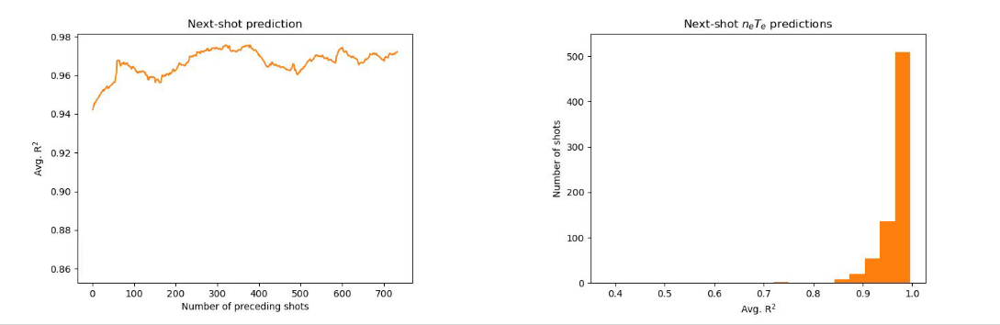

[← back to home](../index.md)

# Neural networks for fusion plasma prediction

In the summer of 2020, I worked with Dan Boyer at the Princeton Plasma Physics Laboratory (PPPL) to create a neural network for predicting fusion plasma properties in real time, for use in fusion reactor control systems. The neural network was successful, achieving high accuracy with extremely fast execution times.

My poster for the 2020 APS DPP meeting can be found [here](/files/fusion-poster.pdf), and more detailed slides [here](/files/fusion-slides.pdf). We published our work in *Nuclear Fusion* (<a href="https://doi.org/10.1088/1741-4326/abe08b" target="_blank" rel="noopener noreferrer">doi.org/10.1088/1741-4326/abe08b</a>).

### Tokamak reactors and control systems

---

The Tokamak is the most popular fusion reactor design. It is used in many fusion experiments today, including [ITER](https://www.iter.org), the largest fusion reactor ever built. A Tokamak consists of a toroidal chamber in which the plasma is suspended in a magnetic field. The magnetic field accelerates the ions in the plasma until they are hot enough to spontaneously fuse into new atoms. This fusion process releases high-energy neutrinos that are collected by the walls of the reactor and turned into usable energy (ideally, producing more energy than it takes to heat the plasma). Fusion energy is still in the experimental phase, but is coming closer to commercial viability every year. Currently, the most challenging part of fusion is keeping the plasma stable for long enough to allow for fusion to happen, which involves making small corrections to the magnetic field in response to changing conditions in the plasma.

Reactors have sensors that can measure instantaneous values such as plasma current and average density. However, there is no way to directly measure more complex aspects of the plasma, such as its 2-dimensional density cross section. Physics-based simulation code can calculate this density profile, but takes hours to do so because of the complex physics involved.

Control systems are the automatic programs that continually make small adjustments to the magnets to keep the plasma stable. They are a critical part of creating an effective fusion reactor. To make the correct adjustments, control systems need access to as much information about the current state of the plasma as possible. Information such as the density cross section would be very useful to know the current state of the plasma, as well as predict what certain adjustments might do to the plasma. Existing physics-based simulations are far too slow for an automatic control system, though, because the update cycle is on the order of hundreds of microseconds.

### Neural networks for profile estimation

---

The neural network has access to 9 input variables corresponding to instantaneous values of the plasma at a given time. These variables include plasma current, upper and lower triangularity (measures of the shape of the plasma), and others. The goal of the network was to predict a sequence of values corresponding to the density of the plasma at many radial points from the center to the outer edge, through the central plane of the toroidal plasma, as well as values for the pressure of the plasma at the same points. In effect, the neural network produces two 1-dimensional functions based on 9 input numbers.

We used data from NSTX, the fusion reactor at PPPL, which has since been upgraded to <a href="https://pppl.gov/nstx" target="_blank" rel="noopener noreferrer">NSTX-U</a>. The dataset consists of (TODO) years of data from (TODO - TODO). The density and pressure profiles were calculated by <a href="https://transp.pppl.gov" target="_blank" rel="noopener noreferrer">TRANSP</a>, PPPL's physics-based simulation code, which we assumed to be highly accurate representations of the actual values (which cannot be measured). TRANSP outputs the density and pressure profiles as sequences of 20 points each, ranging from the inner edge of the toroidal plasma to the outer edge.

We found our model to be most effective with 4 fully connected intermediate layers of 100 nodes each, in addition to the input layer and output layer. The density and pressure profiles were processed using <a href="https://en.wikipedia.org/wiki/Principal_component_analysis" target="_blank" rel="noopener noreferrer">principal component analysis</a> to reduce each profile to 6 values instead of 20, while still accounting for 97% of variance in profile shapes.

To recreate the conditions in which a neural network like this would actually be used, we trained the network on a certain chronological range of the historical data and then tested it on the next shots afterwards. At the top of this section is a graph of the network accuracy when training on the first *n* shots and predicting the next shot in order.

We expect accuracy above ~85-90% to be useful for control systems applications.

[Poster](/files/fusion-poster.pdf)

[Detailed slides from poster presentation](/files/fusion-slides.pdf)

[← back to home](../index.md)